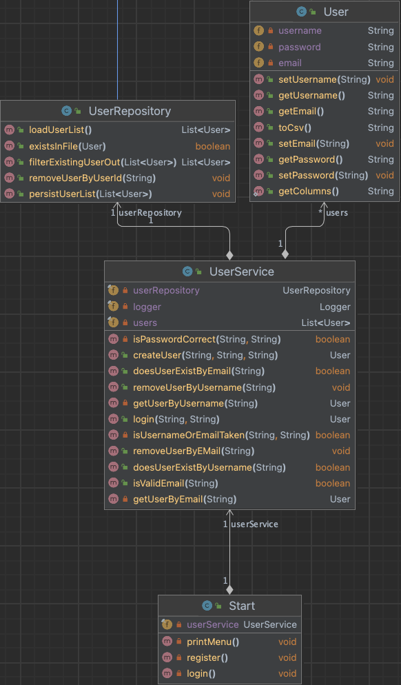

Diese Dokumentation begleitet unser Software-Projekt, an dem Paul Ehrhard (Matrikel-Nr.: 6902762) und Jona Kuhn (Matrikel-Nr.: 2399244) beteiligt waren.
Um den hohen Anforderungen an Qualität und Klarheit gerecht zu werden, wurde eine besondere Arbeitsmethode verfolgt: Pair Programming. Durch den kontinuierlichen Austausch und die gemeinsame Problemlösung konnte ein ausgewogenes Verständnis des Projekts und eine gleichmäßige Beteiligung sichergestellt werden. 


# ASE 2023 - Travel Planner

## Kapitel 1: Einführung

### 1.1. Übersicht über die Applikation

In der heutigen Welt, in der die Reiseplanung oft eine Vielzahl von Ressourcen und Plattformen erfordert - von der Suche nach dem perfekten Reiseziel, über die Buchung von Tickets und Unterkünften, bis hin zur Planung von Aktivitäten vor Ort - kann das Organisieren einer Reise eine komplexe und zeitaufwändige Aufgabe sein. Es ist genau dieses Problem, das unsere Applikation, "TravelPlaner", angeht und zu lösen versucht.

TravelPlaner ist mehr als nur eine Reiseplanungs-App. Es ist eine umfassende Plattform, die darauf abzielt, die Reiseerfahrung von Anfang bis Ende zu optimieren. Sie kombiniert alle Aspekte der Reiseplanung und -verwaltung in einer einzigen, benutzerfreundlichen Anwendung, die den Benutzern ermöglicht, ihre Ausflüge auf effiziente und intuitive Weise zu organisieren.

Das Herzstück der TravelPlaner-Anwendung ist die personalisierte Benutzererfahrung. Die Anwendung erkennt, dass jede Reise einzigartig ist und ermöglicht es den Benutzern daher, ihre eigenen spezifischen Reisepläne zu erstellen und zu verwalten. Benutzer können sich anmelden und eine Reihe von Funktionen nutzen, die entwickelt wurden, um den Reiseplanungsprozess zu rationalisieren und zu personalisieren:

1. **Get Travel Overview:** Mit dieser Funktion können Benutzer eine Übersicht über ihre geplanten Reisen erhalten. Dies umfasst Informationen wie das Reiseziel, geplante Aktivitäten, Transportmittel und möglicherweise auch Details zu Unterkünften und gebuchten Tickets. 
2. **Add Travel:**  Hier können Benutzer neue Reisen zu ihrem Plan hinzufügen. Sie können Details wie das Reiseziel, das Datum und die gewünschten Aktivitäten eingeben.
   Remove Travel: Diese Funktion ermöglicht es Benutzern, eine geplante Reise aus ihrem Plan zu entfernen. Dies könnte nützlich sein, wenn sich Pläne ändern oder ein Reiseziel aus irgendeinem Grund nicht mehr attraktiv ist.
3. **Remove Travel:** Diese Funktion ermöglicht es Benutzern, eine geplante Reise aus ihrem Plan zu entfernen. Dies könnte nützlich sein, wenn sich Pläne ändern oder ein Reiseziel aus irgendeinem Grund nicht mehr attraktiv ist. 
4. **Manage Travel Activities:** Hier können Benutzer die Aktivitäten für jede ihrer geplanten Reisen verwalten. Sie können neue Aktivitäten hinzufügen, bestehende Aktivitäten ändern oder löschen.
5. **Check Weather:** Diese Funktion ermöglicht es Benutzern, das aktuelle Wetter an ihren Reisezielen zu überprüfen. So können sie sich besser auf ihre Reise vorbereiten und gegebenenfalls ihre Pläne anpassen.
6. **Check Activities:** Mit dieser Funktion können Benutzer eine Liste aller geplanten Aktivitäten einsehen. Das könnte ihnen helfen, ihre Zeit besser zu planen und sicherzustellen, dass sie nichts verpassen.
7. **Logout:** Nachdem die Benutzer ihren Reiseplan abgeschlossen und alle benötigten Informationen erhalten haben, können sie sich sicher von der Plattform abmelden.

Die TravelPlaner-App nutzt die neuesten Technologien, einschließlich einer Reihe von APIs, um Benutzern aktuelle und genaue Informationen zu liefern. Dies umfasst alles von Wettervorhersagen bis hin zu Aktivitäten und Ereignissen an den Reisezielen. Mit TravelPlaner haben Reisende alle Informationen, die sie benötigen, zur Hand - was die Reiseplanung einfacher, stressfreier und insgesamt effizienter macht.

Im Großen und Ganzen zielt TravelPlaner darauf ab, das oft chaotische und zeitaufwändige Unterfangen der Reiseplanung zu revolutionieren. Indem es eine One-Stop-Lösung für alle Reisebedürfnisse bietet, ermöglicht es den Reisenden, weniger Zeit mit der Planung zu verbringen und mehr Zeit damit, ihre Reisen zu genießen.


### 1.2. Wie startet man die Applikation?

TravelPlaner ist eine CLI-Anwendung, die in Java 19 geschrieben wurde. Um die Anwendung auszuführen, ist ein Computer mit Java 19 oder höher erforderlich. Die Anwendung ist bereits vollständig konfiguriert, einschließlich aller notwendigen API-Schlüssel, sodass nur der Start der Hauptanwendung erforderlich ist.

Zunächst muss das GitHub-Repository auf den lokalen Rechner geklont werden. Dazu öffnen Sie ein Terminalfenster und geben folgenden Befehl ein: 

```bash
git clone https://github.com/paul910/ASE.git
```

Die Anwendung kann dann im nächsten Schritt über ein Konsolenfenster mit dem folgenden Befehl gestartet werden:

```bash
cd ASE/src/main/java/org/example
java -jar Main.java
```

Im Anschluss kann mit der gestarteten Anwendung interagiert werden.


### 1.3. Wie testet man die Applikation?

Um die Funktionalität von Travel Planner zu testen, wird die Anwendung über ein Konsolenfenster gestartet. Travel Planner bietet eine klare und intuitive Benutzeroberfläche, die dem Benutzer numerische Optionen zur Interaktion präsentiert.

Nach dem Start wird der Nutzer von einer Einführung in die Anwendung begrüßt, in der er die Möglichkeit hat, sich zu registrieren, sich anzumelden oder die Anwendung zu beenden. Bei der Erstnutzung wird empfohlen, einen neuen Benutzer zu registrieren. Die dafür erforderlichen Schritte werden im Dialogprozess klar kommuniziert und sind unkompliziert zu befolgen.

Sobald der Nutzer angemeldet ist, wird er mit einer Reihe von Optionen begrüßt, die den Kern der Travel Planner-Funktionalität darstellen. Er hat die Möglichkeit, eine Übersicht seiner geplanten Reisen einzusehen, neue Reisen hinzuzufügen und bestehende zu entfernen. Darüber hinaus kann er Reiseaktivitäten verwalten, das Wetter an seinem Reiseziel prüfen und vorgeschlagene Aktivitäten überprüfen. Die jeweiligen Optionen werden durch numerische Eingaben ausgewählt.

Es ist zu beachten, dass bei der ersten Anmeldung keine Reisen in der Übersicht vorhanden sind. Daher wird empfohlen, als ersten Schritt eine neue Reise hinzuzufügen, um alle Funktionen vollständig nutzen zu können.

Travel Planner speichert persistent alle Daten, die während der Nutzung anfallen, einschließlich der Reisedetails und geplanten Aktivitäten, in einem lokalen Speicher. Stellen Sie sicher, dass Sie die entsprechenden Rechte zum Erstellen und Schreiben von Dateien und Ordnern im aktuellen Arbeitsverzeichnis haben. Andernfalls kann es zu Fehlern bei der Nutzung der Anwendung kommen.

Im Großen und Ganzen lässt sich Travel Planner leicht testen und bedienen, wodurch das Organisieren Ihrer zukünftigen Reisen vereinfacht und angenehmer gestaltet wird


## 2. Clean Architecture

### 2.1. Was ist Clean Architecture?

Clean Architecture ist ein Softwarearchitektur-Konzept, das von Robert C. Martin, auch bekannt als "Uncle Bob", entwickelt wurde. Dieser Ansatz zielt darauf ab, die Entwicklung von Softwareanwendungen mit hoher Wartbarkeit, Testbarkeit und Flexibilität zu fördern, indem bestimmte Prinzipien und Designmuster eingehalten werden.

Im Kern der Clean Architecture steht die Idee der Trennung von Anliegen durch Schichten. Diese Architektur besteht in der Regel aus mindestens vier konzentrischen Schichten, von innen nach außen: Entitäten, Anwendungsfall, Schnittstellenadapter und Frameworks & Treiber. Jede dieser Schichten hat eine bestimmte Rolle und Verantwortung und sollte voneinander unabhängig sein. Dies wird als Regel der Abhängigkeiten bezeichnet, was bedeutet, dass die Abhängigkeiten immer von den äußeren Schichten zu den inneren Schichten gerichtet sind.

Die **Entitäten** repräsentieren die Geschäftsregeln und -logik der Anwendung. Sie sind am zentralsten und sind völlig unabhängig von anderen Schichten. Der **Anwendungsfall** beschreibt, was die Software tun soll, ohne sich um die Details der Implementierung zu kümmern. Die **Schnittstellenadapter**-Schicht umfasst Adapter, die die Anwendungsfälle und Entitäten mit den externen Agenten wie Datenbanken, Webdiensten oder Benutzerschnittstellen verbinden. Die äußerste Schicht, **Frameworks & Treiber**, umfasst Tools wie Datenbanken und Web-Frameworks, die die Infrastruktur der Anwendung bereitstellen. Die Hauptvorteile der Clean Architecture liegen in ihrer Flexibilität und Testbarkeit. Da jede Schicht von den anderen entkoppelt ist, kann sie unabhängig getestet und modifiziert werden, ohne die anderen Schichten zu beeinflussen. Dies erleichtert die Wartung der Software und ermöglicht eine einfache Integration von Änderungen und neuen Technologien.

Zusammenfassend kann man sagen, dass die Clean Architecture ein wirkungsvoller Ansatz zur Schaffung robuster, nachhaltiger und wartbarer Softwarelösungen ist, die auch auf lange Sicht noch effizient sind und sich gut erweitern lassen.

### 2.2 Analyse der Dependency Rule

Die Dependency Rule ist ein wichtiger Grundsatz der Clean Architecture und besagt, dass Codeabhängigkeiten immer von außen nach innen gerichtet sein sollten, wobei die inneren Schichten keinerlei Wissen über die äußeren Schichten haben sollten. Dies bedeutet, dass höhere Schichten (wie Anwendungsfälle und Entitäten) nicht von niedrigeren Schichten (wie Frameworks und Interfaces) abhängig sein sollten.

Um ein besseres Verständnis von dieser Regel zu erlangen, betrachten wir zwei Klassen unserer Anwendung, eine, die die Dependency Rule einhält (Positivbeispiel), und eine, die sie verletzt (Negativbeispiel).

#### 2.2.1 Positiv-Beispiel: WeatherAPI


Die `WeatherAPI`-Klasse ist ein guter Fall für die Einhaltung der Dependency Rule in der Clean Architecture. Diese Klasse ist in einer niedrigeren Schicht unserer Anwendung platziert und definiert nur, wie eine Wetter-API-Anfrage ausgeführt wird. Das bedeutet, sie ist für die Kommunikation mit der externen Wetter-API verantwortlich und kümmert sich nicht um Details der oberen Schichten oder um die Art der Daten, die von der API zurückgegeben werden.

Abhängigkeiten von WeatherAPI: Da sie sich in der äußersten Schicht der Anwendung befindet, hat sie keine Abhängigkeiten von anderen internen Klassen der Anwendung. Ihre einzige Abhängigkeit könnte eine externe Bibliothek oder ein Framework sein, das für die Kommunikation mit der Wetter-API verwendet wird. Diese Art von Abhängigkeit ist jedoch in Ordnung, da sie nicht die Trennung zwischen den Schichten der Anwendung beeinträchtigt.
Abhängigkeiten zu WeatherAPI: Die `WeatherService`-Klasse in einer höheren Schicht hängt von WeatherAPI ab. Sie nutzt WeatherAPI, um Wetterdaten zu holen und diese Daten dann für die spezifischen Bedürfnisse der Anwendung zu verarbeiten. Die Abhängigkeit ist hier von der höheren zur niedrigeren Schicht gerichtet, was der Dependency Rule entspricht.

#### 2.2.2 Negativ-Beispiel: Travel


Die `Travel`-Klasse stellt ein Domainobjekt dar und sollte daher keine direkte Abhängigkeit von TravelRepository haben, einer Klasse, die für die Datenpersistenz zuständig ist. Die Kopplung dieser beiden Klassen verringert die Flexibilität und Testbarkeit der Anwendung.

Abhängigkeiten von Travel: Die `Travel`-Klasse hat eine direkte Abhängigkeit von TravelRepository, was bedeutet, dass sie sich um Details der Datenpersistenz kümmert. Das widerspricht der Dependency Rule, da Domainobjekte unabhängig von solchen Details bleiben sollten. Ihre Hauptaufgabe ist es, Geschäftsregeln zu definieren und durchzusetzen, und sie sollten durch Services oder andere Mechanismen auf persistente Daten zugreifen können.
Abhängigkeiten zu Travel: Services oder andere Domain-Objekte könnten von Travel abhängen, um Geschäftsaktionen auszuführen oder um Daten zu verarbeiten, die sie benötigen. In einer gut strukturierten Anwendung wäre diese Art von Abhängigkeit von der oberen zur unteren Schicht gerichtet, was der Dependency Rule entspricht.

### 2.3. Analyse der Schichten

#### Schicht: Entities

**Klasse: Travel**


Die `Travel`-Klasse repräsentiert eine Reise, die von einem Benutzer erstellt wurde. Jede Reise hat eine eindeutige ID, einen Ersteller, ein Erstellungsdatum, eine Stadt, ein Budget, ein Start- und Enddatum sowie ein letztes Änderungsdatum.

Die `Travel`-Klasse enthält Methoden zur Verwaltung dieser Eigenschaften, einschließlich Setzen und Abrufen von Werten, sowie zur Konvertierung der Reise in eine CSV-Zeichenkette. Sie holt auch eine neue eindeutige ID vom TravelRepository ab.

**Einordnung in die Clean-Architecture:**

Die `Travel`-Klasse gehört zur Schicht der "Entities" in der Clean Architecture. Die Entities repräsentieren die Geschäftsobjekte der Anwendung und enthalten die Geschäftsregeln, die für die Anwendung relevant sind. Die `Travel`-Klasse repräsentiert ein Geschäftsobjekt, nämlich eine Reise. Sie enthält Geschäftsregeln wie das Format der Reisedaten und das Format des Datums. Sie enthält jedoch auch eine direkte Abhängigkeit zum TravelRepository, was gegen die Dependency Rule in der Clean Architecture verstößt, da die Entities nicht von den äußeren Schichten wie der Datenzugriffsschicht abhängig sein sollten. Dies sollte durch Verwendung eines Interfaces oder einer abstrakten Klasse korrigiert werden, um die direkte Abhängigkeit von Travel zu TravelRepository zu entfernen.

#### Schicht: Interface Adapters

**Klasse: WeatherAPI**


Die `WeatherAPI`-Klasse ist ein Adapter, der es der Anwendung ermöglicht, mit der OpenWeatherMap API zu interagieren. Sie enthält Methoden zur Erstellung einer API-Anfrage und zur Rückgabe der Antwort als String. Die `WeatherAPI`-Klasse hat eine request-Methode, die einen Städtenamen als Eingabe nimmt und eine HTTP-GET-Anfrage an die OpenWeatherMap API sendet. Sie verarbeitet die Antwort, prüft den Antwortcode und gibt den Antwort-String zurück.

**Einordnung in die Clean-Architecture:**

Die `WeatherAPI`-Klasse gehört zur Schicht der "Interface Adapters" in der Clean Architecture. Diese Schicht beinhaltet Adapter, die das Außen- und Innensystem miteinander verbinden, wobei das Innensystem die Business-Logik und die Anwendungsfall-Schicht darstellt, während das Außensystem Dinge wie externe APIs, Datenbanken und Web-Frameworks darstellt.

In diesem Fall dient die `WeatherAPI`-Klasse als Adapter zur OpenWeatherMap API. Sie konvertiert die Details der HTTP-Kommunikation (ein Detail, das für die innere Anwendungslogik irrelevant ist) in eine einfache Methode, die von der Anwendung verwendet werden kann, um Wetterdaten zu erhalten. Daher kann diese Klasse als "Interface Adapter" klassifiziert werden, da sie das Interface (die API) zur Außenwelt bereitstellt und anpasst, um es den inneren Schichten leichter zu machen, damit zu interagieren.

## 3. SOLID

### 3.1. Analyse Single-Responsibility-Principle (SRP)

#### 3.1.1 Positives Beispiel: `PasswordHasher`


Die `PasswordHasher`-Klasse hat nur eine einzige Verantwortung: Sie stellt eine Methode zur Verfügung, um ein Passwort zu hashen. Daher hält sie das Single-Responsibility-Principle ein.

#### 3.1.2 Negatives Beispiel: `UserService`



Die `UserService`-Klasse ist verantwortlich für eine Vielzahl von Aufgaben. Sie kümmert sich sowohl um die Verwaltung von Usern (Erstellen, Löschen), als auch um Authentifizierungsfunktionen (Login, Passwortprüfung). Obwohl diese Funktionen eng miteinander verbunden sind, handelt es sich dabei um unterschiedliche Verantwortlichkeiten.

**Lösungsweg:** Um die Einhaltung des Single-Responsibility-Prinzips sicherzustellen, könnten wir die Authentifizierungsaufgaben in eine separate Klasse verschieben. Diese neue Klasse könnte `UserAuthenticationService` heißen und wäre dann ausschließlich für die Authentifizierung von Benutzern verantwortlich. Methoden wie login und isPasswordCorrect wären dann in dieser neuen Klasse angesiedelt.

Die `UserService` Klasse würde dann nur noch für die Verwaltung von User-Objekten verantwortlich sein, also für das Erstellen und Löschen von Usern. Durch diese Trennung der Verantwortlichkeiten wäre das Single-Responsibility-Prinzip erfüllt.

### 3.2. Analyse Single-Responsibility-Principle (SRP)

#### 3.2.1 Positiv-Beispiel: `APIInterface` 


Die APIInterface Schnittstelle ist ein gutes Beispiel für das Einhalten des Open-Closed-Principles. Sie definiert die Methode `request()`, die von der `ActivityAPI` Klasse implementiert wird. Wenn man eine neue API hinzufügen möchte, kann man einfach eine neue Klasse erstellen, die das APIInterface implementiert, ohne die Schnittstelle oder die bestehende `ActivityAPI` Klasse zu ändern.

#### 3.2.2 Negativ-Beispiel: `UserService` 


Die `UserService` Klasse könnte als ein Beispiel gesehen werden, das das Open-Closed-Principle verletzt, weil sie in ihrer aktuellen Form nicht für Erweiterungen offen ist. Beispielsweise, wenn wir eine neue Art der Authentifizierung hinzufügen möchten (zum Beispiel durch OAuth oder Zwei-Faktor-Authentifizierung), würden wir den existierenden Code in der login() Methode verändern müssen.

**Lösungsweg:** Um dieses Problem zu lösen und das Open-Closed-Principle einzuhalten, könnten wir ein Authenticator Interface einführen, das von verschiedenen Klassen implementiert werden kann, die jeweils eine bestimmte Art der Authentifizierung durchführen. Die `UserService` Klasse würde dann nicht direkt eine Authentifizierungsmethode implementieren, sondern eine Instanz eines Authenticator verwenden. Auf diese Weise könnte das Authentifizierungssystem erweitert werden, indem neue Klassen hinzugefügt werden, die das Authenticator Interface implementieren, ohne dass der Code in der `UserService` Klasse geändert werden müsste.

*TODO: Nachher UML*

### 3.3. Analyse Interface-Segregation-Principle (ISP) 

#### 3.3.1 Positiv-Beispiel: `ActivityAPI` 


Die `ActivityAPI` Klasse implementiert das `APIInterface`, das nur eine Methode `request(city: String)` enthält. Dieses ist ein gutes Beispiel für das Interface-Segregation-Principle, da das `APIInterface` klein und spezifisch für einen bestimmten Zweck (eine HTTP-Anfrage an eine bestimmte API durchführen) ist. Das bedeutet, dass jede Klasse, die dieses Interface implementiert, nicht mit Methoden belastet wird, die sie nicht benötigt.

#### 3.3.2 Negativ-Beispiel: `UserService` 


Die `UserService` Klasse kann als Negativbeispiel für das Interface-Segregation-Principle betrachtet werden, da sie viele Methoden hat, die verschiedene Aspekte der Benutzerverwaltung abdecken. Wenn wir ein Interface für diese Klasse erstellen würden, hätte es viele Methoden und würde wahrscheinlich Methoden enthalten, die nicht alle Klassen benötigen, die dieses Interface implementieren könnten.

Um dieses Problem zu lösen, könnten wir mehrere spezifische Interfaces erstellen, z.B. `UserCreator`, `UserRemover`, `UserAuthenticator`, etc., die jeweils eine kleinere Anzahl von Methoden enthalten, die spezifisch für ihre Funktion sind. Die `UserService` Klasse könnte dann diese Interfaces implementieren, je nachdem welche Funktionen sie benötigt. Dies würde das Interface-Segregation-Principle erfüllen, da jede Klasse, die diese Interfaces implementiert, nur die Methoden erhält, die sie benötigt.

## 4. Weitere Prinzipien

### 4.1. Analyse GRASP: Geringe Kopplung

#### 4.1.1. Positiv-Beispiel: `User`


Die `User` Klasse ist ein gutes Beispiel für geringe Kopplung. Sie repräsentiert einen Nutzer und hat nur Informationen und Methoden, die direkt mit den Eigenschaften eines Nutzers zusammenhängen (wie Username, Passwort und Email-Adresse). Sie ist nicht von anderen Klassen abhängig, was sie zu einer unabhängigen und gut entkoppelten Klasse macht.

#### 4.1.2. Negativ-Beispiel `TravelService` 


Die `TravelService` Klasse zeigt ein Beispiel für eine hohe Kopplung in unserem System. Diese Klasse hat direkte Abhängigkeiten zu drei verschiedenen Repository-Klassen: `TravelRepository`, `ActivityRepository` und `TravelActivitiesRepository`. Darüber hinaus verwaltet sie den Zustand mehrerer Entitäten, einschließlich einer Liste von Travel-Objekten und einem User-Objekt.

Die hohe Kopplung in dieser Klasse kann zu mehreren Problemen führen. Änderungen in einem der Repository-Klassen könnten dazu führen, dass wir auch Änderungen in der `TravelService` Klasse vornehmen müssen. Darüber hinaus könnte die Komplexität dieser Klasse mit der Zeit zunehmen, da sie verschiedene Aspekte des Systems verwaltet.

Um diese hohe Kopplung zu reduzieren, könnten wir verschiedene Techniken anwenden. Eine davon könnte die Anwendung des Single Responsibility Principle (SRP) sein, indem wir separate Service-Klassen für unterschiedliche Verantwortlichkeiten erstellen. Zum Beispiel könnten wir eine `UserService` Klasse für die Verwaltung von Benutzern und eine `ActivityService` Klasse für die Verwaltung von Aktivitäten erstellen.

### 4.2. Analyse GRASP: Hohe Kohäsion

#### 4.2.1. Positiv-Beispiel: `User`


Die `User` Klasse ist ein gutes Beispiel für hohe Kohäsion in der objektorientierten Programmierung. Diese Klasse ist dafür verantwortlich, den Zustand und das Verhalten eines Nutzers zu repräsentieren. Alle ihre Attribute und Methoden sind eng miteinander verbunden und arbeiten gemeinsam auf ein einheitliches Ziel hin: die Verwaltung der Nutzerinformationen. Diese starke Zusammengehörigkeit der Teile innerhalb der Klasse zeigt eine hohe Kohäsion.

Die `User` Klasse hat Funktionen wie `getUsername()`, `getPassword()`, `getEmail()`, `setUsername()`, `setPassword()` und `setEmail()`, die alle eng miteinander verbunden sind und gemeinsam dazu dienen, die Benutzerdaten zu verwalten. Diese Methoden haben alle einen starken Zusammenhang und wirken zusammen, um die Funktion der Klasse zu erfüllen. Dies ist eine klare Darstellung der hohen Kohäsion in der OOP.

### 4.3. Don't Repeat Yourself (DRY)

*TODO*

## 5. Unit Tests

### 5.1. 10 Unit Tests

| Unit Test | Beschreibung |
| --- | --- |
| `testGetCity` (WeatherTest) | Prüft, ob die Methode `getCity` der Klasse `Weather` korrekt den Namen der Stadt zurückgibt. |
| `testCreateUser` (UserServiceTest) | Prüft, ob ein Nutzer korrekt erstellt wird und verifiziert das Verhalten, wenn ein Nutzername bereits vorhanden ist oder eine ungültige E-Mail-Adresse verwendet wird. |
| `testRemoveUserByEMail` (UserServiceTest) | Prüft, ob ein Nutzer über seine E-Mail-Adresse korrekt aus der Liste der Nutzer entfernt wird und verifiziert das Verhalten, wenn ein Nutzer mit einer bestimmten E-Mail-Adresse nicht existiert. |
| `testGetWeather` (WeatherServiceTest) | Prüft, ob die Methode `getWeather` der Klasse `WeatherService` korrekt das Wetter für eine bestimmte Stadt zurückgibt. |
| `testGetPassword` (UserTest) | Prüft, ob die Methode `getPassword` der Klasse `User` korrekt das Passwort des Nutzers zurückgibt. |
| `testGetEmail` (UserTest) | Prüft, ob die Methode `getEmail` der Klasse `User` korrekt die E-Mail-Adresse des Nutzers zurückgibt. |
| `testGetColums` (UserTest) | Prüft, ob die Methode `getColumns` der Klasse `User` korrekt die Namen der Spalten zurückgibt. |
| `parseObject` (JsonParserTest) | Prüft, ob die Methode `parseObject` der Klasse `JsonParser` ein JSON-String korrekt in ein Objekt umwandelt. |
| `testPersistUserList` (UserRepositoryTest) | Prüft, ob die Methode `persistUserList` der Klasse `UserRepository` eine Liste von Nutzern korrekt in eine Datei schreibt. |
| `testLoadUserList` (UserRepositoryTest) | Prüft, ob die Methode `loadUserList` der Klasse `UserRepository` eine Liste von Nutzern korrekt aus einer Datei lädt. |

### ATRIP: Automatic

1. Selbständige Ausführung der Tests: Jeder Unit-Test in dem Projekt ist so konzipiert, dass er unabhängig von den anderen laufen kann. Die Tests erfordern keine manuelle Eingabe oder Ergebnisüberprüfung. Stattdessen führt das Test-Framework die Tests aus und vergleicht die Ergebnisse automatisch mit den erwarteten Werten.
2. Automatische Setups und Teardowns: Mithilfe von @BeforeEach und @AfterEach Annotations werden spezifische Aktionen vor und nach jedem Testdurchlauf automatisch ausgeführt. Dies ermöglicht eine effiziente Testdurchführung, indem redundante manuelle Schritte vermieden werden.
3. Automatische Assertion: Die Assertion-Mechanismen in den Tests stellen sicher, dass die Ergebnisse der getesteten Methoden automatisch mit den erwarteten Werten verglichen werden. Dies bietet eine effiziente und zuverlässige Möglichkeit, die Korrektheit des Codes zu gewährleisten.

### 5.2. ATRIP: Thorough 

#### 5.2.1. Positives Beispiel:

Code-Beispiel:

```java
@Test
public void testCreateUser() {
    // Test creating a user with valid credentials
    assertNotNull(this.user1);
    assertEquals("user1", user1.getUsername());
    assertEquals("user1@example.com", user1.getEmail());

    // Test creating a user with a taken username
    User user2 = userService.createUser("user1", "password", "user2@example.com");
    assertNull(user2);

    // Test creating a user with an invalid email address
    User user3 = userService.createUser("user3", "password", "invalid-email-address");
    assertNull(user3);
}
```
Dieser Test ist ein gutes Beispiel für 'Thorough', weil er verschiedene Szenarien abdeckt. Er testet nicht nur das erfolgreiche Erzeugen eines Benutzers, sondern auch die Fälle, in denen das Erzeugen eines Benutzers fehlschlagen sollte. Auf diese Weise wird sichergestellt, dass die Methode createUser unter allen erwarteten Bedingungen korrekt funktioniert.

#### 5.2.2. Negatives Beispiel:

Code-Beispiel:

```Java
@Test
public void testGetPassword() {
    User user = new User("john_doe", "password123", "john_doe@example.com");
    assertEquals("password123", user.getPassword());
}
```

Dieser Test ist ein negatives Beispiel für 'Thorough', weil er nur ein Szenario abdeckt. Er überprüft, ob das Passwort korrekt gesetzt wurde, aber er testet nicht die Fälle, in denen das Setzen des Passworts fehlschlagen könnte, zum Beispiel, wenn das Passwort null ist oder nicht den Passwortanforderungen entspricht. Daher könnte die setPassword-Methode unter bestimmten Bedingungen fehlerhaft sein, und dieser Test würde es nicht erkennen.

### 5.3 ATRIP: Professional

#### 5.3.1. Positives Beispiel

```Java
@Test
public void testCreateUser() {
    // Test creating a user with valid credentials
    assertNotNull(this.user1);
    assertEquals("user1", user1.getUsername());
    assertEquals("user1@example.com", user1.getEmail());

    // Test creating a user with a taken username
    User user2 = userService.createUser("user1", "password", "user2@example.com");
    assertNull(user2);

    // Test creating a user with an invalid email address
    User user3 = userService.createUser("user3", "password", "invalid-email-address");
    assertNull(user3);
}
```

Dieser Test ist ein gutes Beispiel für Professionalität. Er ist sauber und klar strukturiert und hat aussagekräftige Kommentare, die erklären, was jeder Teil des Tests macht. Darüber hinaus behandelt der Test mehrere Testfälle, was hilft, die Robustheit des Codes sicherzustellen.

#### 5.3.2. Negatives Beispiel:

```Java
@Test
public void testGetPassword() {
    User user = new User("john_doe", "password123", "john_doe@example.com");
    assertEquals("password123", user.getPassword());
}
```
Obwohl dieser Test korrekt funktioniert, könnte er als weniger professionell angesehen werden, da er nur eine einfache Funktionalität testet und keine Kommentare oder weiteren Testfälle enthält. Ein professioneller Test sollte verschiedene mögliche Szenarien abdecken und klar kommentiert sein, um seine Absicht zu erklären. Es wäre zum Beispiel hilfreich, zusätzliche Tests hinzuzufügen, um zu überprüfen, wie die Methode auf ungültige Eingaben reagiert.

### 5.4 Code Coverage

*TODO UML*

### 5.5 Fakes und Mocks

*TODO UML*

## 6. Domain Driven Design

### 6.1. Ubiquitous Language

| Bezeichnung | Bedeutung | Begründung |
|---|---|---|
| User | Ein registrierter Nutzer in der Anwendung | "User" ist ein Begriff, der überall in der Anwendung verwendet wird, um sich auf eine Person zu beziehen, die sich registriert hat und die Anwendung nutzt. Es ist ein grundlegender Begriff, der von allen Teammitgliedern verstanden und verwendet wird. |
| UserService | Ein Service, der alle Operationen im Zusammenhang mit einem User verwaltet | "UserService" ist ein zentrales Konzept in der Anwendung, das die Geschäftslogik für Operationen im Zusammenhang mit Usern enthält. Es wird von allen Teammitgliedern verwendet und verstanden. |
| WeatherAPI | Ein Interface zur Kommunikation mit einem externen Wetterdienst | "WeatherAPI" ist ein konkreter Begriff, der innerhalb des Teams verwendet wird, um sich auf den externen Service zu beziehen, der Wetterdaten bereitstellt. Es ist ein wichtiger Teil des Kontextes unserer Anwendung. |
| UserRepository | Ein Repository zur Verwaltung von User-Daten in einer Datenbank | "UserRepository" ist ein Begriff, der spezifisch in unserem Kontext verwendet wird, um die Komponente zu bezeichnen, die für die dauerhafte Speicherung und Abfrage von User-Daten zuständig ist. Es ist ein universeller Begriff, der von allen Teammitgliedern verstanden und genutzt wird. |

### 6.2. Entities


Die `User`-Klasse ist ein fundamentales Konzept in der Anwendung, das eine registrierte Person repräsentiert. Es hat Eigenschaften wie username, password und email, die den Zustand des Benutzers definieren. Entities sind Objekte, die über einen längeren Zeitraum kontinuierlich existieren und eine eindeutige Identität haben. In diesem Fall ist die `User`-Klasse eine Entity, weil sie eine eindeutige Identität in Form des username oder email hat und über einen längeren Zeitraum in der Anwendung existiert. Sie wird in verschiedenen Teilen der Anwendung verwendet, um Aktionen im Namen des Benutzers durchzuführen. Beispielsweise könnte das System den Benutzer authentifizieren, seine Daten ändern, seine Aktivitäten anzeigen oder ihn aus dem System entfernen, indem es auf diese Entity zugreift.

### 6.3. Value Objects


Die `Weather`-Klasse stellt die Wetterinformationen für eine bestimmte Stadt dar. Sie hat Eigenschaften wie city, main, description und temp, die den aktuellen Wetterzustand der Stadt darstellen. Value Objects sind unveränderliche Objekte, deren Identität durch ihre Attribute und nicht durch eine eindeutige Kennung bestimmt wird. In diesem Fall ist Weather ein Value Object, da sein Wert vollständig durch seine Attribute definiert wird. Zwei Weather-Objekte können als gleich betrachtet werden, wenn sie die gleiche city, main, description und temp haben, unabhängig davon, ob sie verschiedene Instanzen sind. Dies ist nützlich in Szenarien, in denen Sie die Wetterdaten für eine bestimmte Stadt darstellen möchten, ohne sich um Identität oder Zustandsänderungen kümmern zu müssen. Die Unveränderlichkeit dieser Objekte macht sie auch sicher in Bezug auf Nebenläufigkeitsprobleme, da sie nach ihrer Erstellung nicht geändert werden können.

### 6.4. Aggregates


Die `UserService`-Klasse ist ein Aggregat, das eine Menge von User-Objekten verwaltet. Sie bietet Methoden zum Erstellen und Entfernen von Benutzern sowie zum Überprüfen der Existenz von Benutzern anhand von Benutzernamen oder E-Mail-Adressen. Ein Aggregate ist in DDD ein Muster, das dazu dient, die Konsistenz von Änderungen an zusammengehörigen Objekten zu gewährleisten. In diesem Fall sorgt UserService dafür, dass alle Änderungen an User-Objekten konsistent sind. Beispielsweise stellt es sicher, dass kein User-Objekt mit einem bereits vorhandenen Benutzernamen oder einer bereits vorhandenen E-Mail-Adresse erstellt wird. Es kapselt die Regeln und Geschäftslogik rund um User-Objekte ein, was die Verwaltung von Benutzern in der Anwendung vereinfacht. Dadurch wird sichergestellt, dass alle Regeln eingehalten werden, unabhängig davon, wo im Code ein User-Objekt manipuliert wird.

## 7. Refactoring

### 7.1. Code Smells

Code Smell: Dead Code ([Commit](https://github.com/paul910/ASE/commit/dfd7fc1c0c674046ef230e95347488180608d652))

vorher: 

```java
 public void loadActivities() {
     this.activities.clear();
     this.activities.addAll(this.activityRepository.loadList());
 }

 public void loadActivitiesByCity(String city) {
     this.activities.clear();
     this.activities.addAll(this.activityRepository.loadListByCity(city));
 }
```

nachher:
```java
public void loadActivities() {
     this.activities.clear();
     this.activities.addAll(this.activityRepository.loadList());
 }
```

Die vorliegende Code-Optimierung beseitigt einen überflüssigen Codeabschnitt, auch bekannt als "Dead Code", in der Klasse `ActivityService`. Besonders zu beachten ist hierbei die Methode `loadActivitiesByCity`, die ursprünglich entwickelt wurde, allerdings im weiteren Verlauf des Programms keine Verwendung findet. Durch diese Bereinigung wird der Code schlanker und effizienter.

### 7.2. 2 Refactoring Beispiele

#### Refactoring 1:  Verletzung der Kapselung ([Commit](https://github.com/paul910/ASE/commit/c743392a8814e9e88954ef27c684998860b8319b))

vorher:
```java

package org.planner.domain;

import org.planner.persistence.TravelRepository;

...

public class Travel {
   ...

    public Travel(User user, String city, double budget, Date startDate, Date endDate) {
        this.id = setId();
        ...
    }
    
   ...

    private Long setId() {
        return TravelRepository.getNewId();
    }
    
   ...
}
```

nachher: 

```java
   package org.planner.domain;

   ...

   public class Travel {
      ...
   
       public Travel(String id, User user, String city, double budget, Date startDate, Date endDate) {
           this.id = id;
           ...
       }
       
      ...
   }

```

Im gegebenen Fall, wo die `Travel`-Klasse direkt auf das `TravelRepository` zugreift, wird die Trennung der Schichten verletzt. Dies kann zu Problemen mit Testbarkeit, Wartbarkeit und Flexibilität führen. Es ist besser, die Verantwortung für die Persistenz von Travel-Objekten an eine Service Klasse zu delegieren, das außerhalb der `Travel`-Klasse liegt. Im refactorten Code wird dies genau umgesetzt und die ID im Konstruktor übergeben.

#### Refactoring2: Umbennenen der Methode ([Commit](https://github.com/paul910/ASE/commit/3930aba749c24a9510eedd09b6a706a292e50f21))

vorher: 

```java
public List<User> filterExistingUserOut(List<User> users) {
     List<User> usersToSave = new CopyOnWriteArrayList<>();
     for (User user : users) {
         if (!existsInFile(user)) {
             usersToSave.add(user);
         }
     }
     logger.info("User list filtered successfully.");
     return usersToSave;
 }
```

nachher:

```java
public List<User> filterOutExistingUser(List<User> users) {
        List<User> usersToSave = new CopyOnWriteArrayList<>();
        for (User user : users) {
            if (!existsInFile(user)) {
                usersToSave.add(user);
            }
        }
        logger.info("User list filtered successfully.");
        return usersToSave;
    }
```

Die Methode ``filterExistingUserOut`` wurde in ``filterOutExistingUsers`` umbenannt.

Die Umbenennung der Methode trägt zu mehreren Verbesserungen in unserer Codebasis bei:

- Semantische Klarheit: Der neue Name ``filterOutExistingUsers`` stellt klar, dass die Methode bestehende Benutzer aus der übergebenen Liste filtert. Diese Änderung verbessert die Lesbarkeit des Codes und die Verständlichkeit dessen, was die Methode tatsächlich tut.

- Konsistenz: Unsere Codebase folgt einer Namenskonvention, bei der Verben vor Substantiven platziert werden. Die Umbenennung der Methode folgt diesem Standard und trägt zu einer konsistenteren Codebasis bei.

- Einheitlichkeit: Die Einheitlichkeit in der Benennung von Methoden ist wichtig. Durch die Umbenennung folgen wir der Konvention, Methodennamen mit einem Verb zu beginnen. Dies verbessert die Einheitlichkeit und die Vorhersehbarkeit unseres Codes.

- Sprachliche Genauigkeit: Der neue Name ``filterOutExistingUsers`` ist grammatikalisch korrekter und natürlicher in der englischen Sprache. Dies verbessert die Verständlichkeit des Codes für alle, die ihn lesen und damit arbeiten.

## 8. Entwurfsmuster

*TODO*